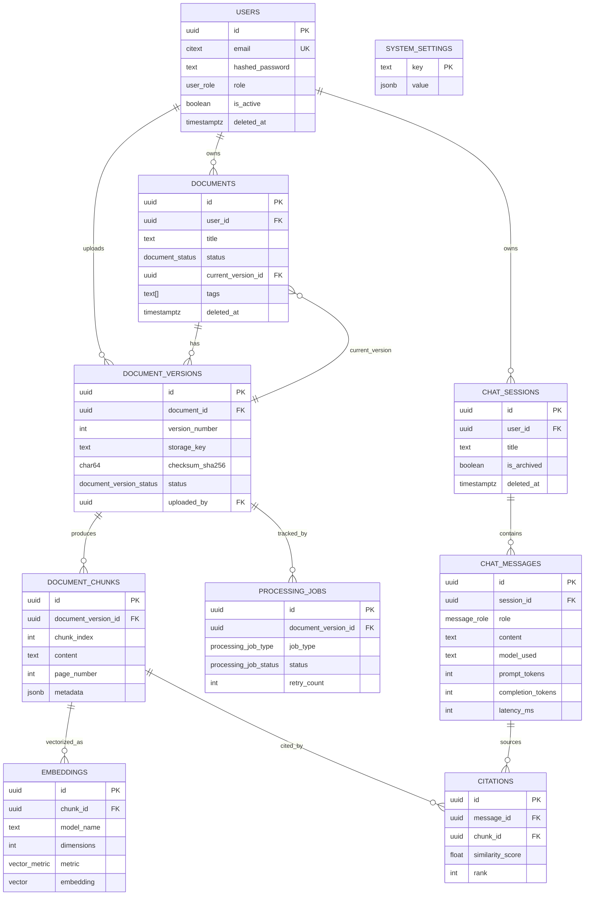

# Local RAG ("Talk to My Data") — Database Design

PostgreSQL 17 + pgvector schema for a multi-user RAG application. Runnable SQL
lives in [`db/sql/`](../db/sql); ORM models live in
[`app/db/models.py`](../app/db/models.py).

---

## 1. ER Diagram



---

## 2. Design Explanation

**Document vs. document_version split.** `documents` is the stable, user-facing
identity (title, tags, one row per logical file). `document_versions` is the
immutable record of one uploaded file. Re-uploading the same document (a
corrected PDF, a newer contract draft) creates a new version rather than
mutating chunks/embeddings in place — old chunks and embeddings stay queryable
until the new version finishes processing, so retrieval never serves a
half-indexed document. `documents.current_version_id` points at the version
that should be used for retrieval; switching it is a single-row update, which
makes "roll back to previous version" trivial and atomic.

**Chunks are immutable, embeddings are not 1:1 with chunks.** A chunk's text
never changes after creation (re-chunking produces a new version). But a chunk
may have zero, one, or several embeddings — one per embedding model. This is
what lets you swap Qwen3 for a different Ollama model, or add a second model
for A/B retrieval quality comparisons, without deleting history: `UNIQUE
(chunk_id, model_name)` enforces at most one embedding per model per chunk,
not one embedding per chunk.

**Citations as a join table, not a JSON blob on the message.** Storing
citations relationally (rather than as a `jsonb` array on `chat_messages`)
keeps them queryable — "which documents get cited most", "did we ever cite a
now-deleted chunk" — and keeps `chunk_id` a real foreign key, so referential
integrity holds even as chunks are added/removed by re-processing.

**processing_jobs as an append-only audit log, not a single status column.**
`document_versions.status` gives the current pipeline stage at a glance;
`processing_jobs` gives the full history of attempts per stage, including
retries and error messages. This is what a worker queue polls and what an
admin dashboard uses to show "embedding failed twice, third attempt running."

**Soft deletes only where history matters.** `users`, `documents`, and
`chat_sessions` get `deleted_at` because losing a chat transcript or a
document's presence in citation history breaks the audit trail for messages
that reference it. `document_chunks`, `embeddings`, and `citations` are hard
FK `ON DELETE CASCADE` from their parent — once a document_version is really
gone (e.g. GDPR erasure), its derived data should go with it rather than
lingering as orphaned soft-deleted rows.

**UUID primary keys everywhere.** Avoids leaking sequential IDs (document
counts, user counts) through the API, and lets the FastAPI layer generate IDs
client-side if needed (e.g. for optimistic UI) without a round trip.

---

## 3. SQL DDL

See the numbered files in [`db/sql/`](../db/sql), applied in order:

| File | Contents |
|---|---|
| [`001_extensions.sql`](../db/sql/001_extensions.sql) | `vector`, `pgcrypto`, `citext`, `pg_trgm`, `btree_gin` |
| [`002_enums.sql`](../db/sql/002_enums.sql) | All PostgreSQL enum types |
| [`003_tables.sql`](../db/sql/003_tables.sql) | All 10 tables, constraints, `updated_at` triggers |
| [`004_indexes.sql`](../db/sql/004_indexes.sql) | All indexes, with rationale comments |
| [`005_example_queries.sql`](../db/sql/005_example_queries.sql) | Retrieval, hybrid search, transcript load, dashboards |

Apply locally:

```bash
psql "$DATABASE_URL" -f db/sql/001_extensions.sql
psql "$DATABASE_URL" -f db/sql/002_enums.sql
psql "$DATABASE_URL" -f db/sql/003_tables.sql
psql "$DATABASE_URL" -f db/sql/004_indexes.sql
```

In practice, Alembic (below) owns this after the initial migration is
generated from these files — don't run them by hand against a database
Alembic also manages.

---

## 4. PostgreSQL Enums

Defined in `002_enums.sql`: `user_role`, `document_status`,
`document_version_status`, `processing_job_type`, `processing_job_status`,
`message_role`, `vector_metric`. Rationale for using native enums over a
`CHECK IN (...)` or a lookup table: these value sets are small, stable, and
part of the application's state machine (not user-editable data), so a native
enum gives cheap storage (4 bytes), index-friendly equality, and a schema-level
guarantee invalid states can't be inserted. If a status set is likely to grow
frequently (it isn't, here), a lookup table would be preferred — enums require
`ALTER TYPE ... ADD VALUE` (non-transactional pre-PG12, transactional since,
but still an online migration to plan for).

---

## 5. Indexes

Full list with inline rationale in [`004_indexes.sql`](../db/sql/004_indexes.sql).
Summary by concern:

| Concern | Index | Why |
|---|---|---|
| Vector search | `embeddings_embedding_hnsw_cosine_idx` (HNSW, `vector_cosine_ops`) | The hot path — ANN search for every chat turn. HNSW over IVFFlat because it needs no upfront training pass and gives better recall/latency without periodic `REINDEX` as data grows. |
| Chat history | `chat_messages_session_created_idx` | Loading a transcript is always "all messages for session X, oldest first" — a composite index avoids a sort. |
| Chat list | `chat_sessions_user_recent_idx` | Sidebar sorts by most-recently-active chat; composite `(user_id, last_message_at DESC)` serves it directly. |
| User lookup | `users_email_active_uidx` | Every login does an email lookup; partial (`WHERE deleted_at IS NULL`) keeps it small and lets emails be reused after soft-delete. |
| Document lookup | `documents_user_status_idx` | Document library screen filters by owner + status ("show me my failed uploads"). |
| Status queries | `processing_jobs_active_status_idx` (partial) | Worker polling only ever queries `pending`/`running` jobs; indexing 100% of rows once most are `completed` wastes space and hurts write throughput. |
| Hybrid/keyword search | `document_chunks_content_trgm_idx`, `documents_title_trgm_idx` | Trigram GIN indexes back `ILIKE`/`%` fuzzy search, used both standalone and blended into hybrid retrieval (see example query #2). |

---

## 6. pgvector Setup

```sql
CREATE EXTENSION IF NOT EXISTS vector;
```

- **Dimension:** `embeddings.embedding` is `VECTOR(768)`, matching
  `nomic-embed-text` served through Ollama. pgvector requires a *fixed*
  dimension per column — see [§15](#15-future-extensibility) for how to add a
  second, differently-sized model later.
- **Distance metric:** cosine (`vector_cosine_ops`), since embedding models are
  typically trained/compared under cosine similarity and Qwen3 embeddings are
  L2-normalized. `embeddings.metric` records this per-row for forward
  compatibility if a future model prefers L2 or inner product.
- **Index type:** HNSW, built with `m = 16, ef_construction = 64` (pgvector
  defaults, good starting point up to a few million vectors). Query-time
  recall/latency is tuned per-query with `SET LOCAL hnsw.ef_search = 100`
  (higher = better recall, slower).
- **Operator:** `<=>` (cosine distance, `1 - cosine_similarity`). Always
  `ORDER BY embedding <=> query_vector` — reversing the order or using `<->`
  (L2) silently bypasses the cosine index.

---

## 7. SQLAlchemy Model Structure

See [`app/db/models.py`](../app/db/models.py). Structure notes:

- One `Base` (`DeclarativeBase`), one file per bounded concern is fine at this
  size; split into `app/db/models/{user,document,chat}.py` once the file
  exceeds ~400 lines.
- `TimestampMixin` centralizes `created_at`/`updated_at` — every table that
  needs both inherits it; `document_chunks` and `embeddings` (immutable,
  `created_at`-only) opt out of `updated_at`.
- Python `enum.Enum` classes mirror the PostgreSQL enums 1:1; SQLAlchemy maps
  them via `String` + `server_default` rather than `sa.Enum(..., native_enum=True)`
  so Alembic diffs stay simple — the PG enum type itself is managed directly in
  migrations (see below), not autogenerated from the Python enum.
- `pgvector.sqlalchemy.Vector(768)` is the `embedding` column type — requires
  the `pgvector` Python package (`pip install pgvector`).
- `documents.current_version_id` is a nullable FK with `use_alter=True` to
  break the circular dependency with `document_versions` at table-creation
  time (mirrors `ALTER TABLE ... ADD CONSTRAINT` in the raw SQL).

---

## 8. Alembic Migration Plan

```bash
pip install alembic pgvector
alembic init alembic
```

`alembic/env.py`: import `app.db.models.Base` as `target_metadata`; enable
`compare_type=True` and `compare_server_default=True` in `context.configure()`
so future column-type/default drift is caught by autogenerate.

**Migration sequence** (one migration per concern, not one giant migration —
keeps rollback granular):

1. **`0001_extensions_and_enums`** — hand-written (autogenerate doesn't manage
   extensions or enum *types* well): `CREATE EXTENSION vector/pgcrypto/citext/
   pg_trgm/btree_gin`, then all `CREATE TYPE ... AS ENUM`.
2. **`0002_core_tables`** — `alembic revision --autogenerate` against the
   models for `users`, `documents`, `document_versions`, then hand-add the
   deferred `documents_current_version_fk` (`ALTER TABLE ... ADD CONSTRAINT
   ... USE ALTER`) since autogenerate won't sequence the circular FK correctly
   on its own.
3. **`0003_chunks_and_embeddings`** — autogenerate `document_chunks` +
   `embeddings`; hand-verify the `VECTOR(768)` column type since pgvector's
   SQLAlchemy integration needs the type imported in `env.py` for autogenerate
   to recognize it, otherwise it'll try to drop/recreate the column every run.
4. **`0004_chat`** — autogenerate `chat_sessions`, `chat_messages`,
   `citations`. Hand-add the `total_tokens` **generated column** — Alembic
   autogenerate does not detect `GENERATED ALWAYS AS ... STORED`, so write it
   explicitly: `op.execute("ALTER TABLE chat_messages ADD COLUMN total_tokens ...")`.
5. **`0005_processing_and_settings`** — autogenerate `processing_jobs`,
   `system_settings`.
6. **`0006_indexes`** — hand-written: all indexes from `004_indexes.sql`,
   especially the HNSW index (`op.execute("CREATE INDEX ... USING hnsw ...")`
   — Alembic's `op.create_index` doesn't have first-class HNSW/`WITH (...)`
   support, raw SQL is more reliable here).
7. **`0007_triggers`** — hand-written: `set_updated_at()` function + triggers.

**Rules for this project:**
- Never let autogenerate touch the `vector` column or HNSW index without
  manual review — diff it, don't trust it blindly.
- Every migration must have a working `downgrade()`; test
  `alembic downgrade -1` in CI, not just `upgrade head`.
- Data migrations (backfills) go in their own revision, never bundled with a
  schema-changing revision, so a failed backfill can be retried without
  re-running DDL.

---

## 9. Example Queries

See [`db/sql/005_example_queries.sql`](../db/sql/005_example_queries.sql):
cosine ANN retrieval scoped to a user's ready documents, hybrid
vector+trigram search, full transcript load with citations, document library
dashboard, failed-job ops view, and recent-chats sidebar query.

---

## 10. Best Practices Applied

- **Least-privilege app role.** The FastAPI service connects as a role with
  `SELECT/INSERT/UPDATE/DELETE` on application tables only — no `CREATEDB`,
  no ownership of the schema (owned by a separate migration role Alembic
  uses). Never connect the app as the DB superuser.
- **Explicit constraints over app-only validation.** `CHECK` constraints
  (non-blank content/title, positive counts) and `UNIQUE` constraints exist so
  invalid state is impossible even if a bug or a second write path (a script,
  a background job) bypasses the ORM.
- **`NUMERIC`/`INTEGER` for anything counted or billed** (`prompt_tokens`,
  `file_size_bytes`), never `FLOAT`, to avoid rounding surprises in usage
  reporting.
- **Timestamps are always `TIMESTAMPTZ`**, never bare `TIMESTAMP` — avoids the
  classic "server timezone changed, historical data is now wrong" class of bug.
- **Generated column for `total_tokens`** instead of computing it in every
  query or trusting the app to keep it in sync — one less place for a bug.
- **Partial indexes** wherever a query only ever touches a subset of rows
  (`deleted_at IS NULL`, active job statuses) — smaller index, faster writes,
  same query performance.

---

## 11. Scaling Recommendations

- **Vector index tuning:** as `embeddings` grows past ~1–5M rows, revisit HNSW
  `m`/`ef_construction` (higher = better recall, more build time/memory) and
  measure `ef_search` against real query latency SLOs. `EXPLAIN ANALYZE` every
  retrieval query change.
- **Partition `document_chunks` and `embeddings` by `document_version_id`
  range or hash** once single-tenant data volume makes vacuum/index
  maintenance slow (rule of thumb: tens of millions of rows). Not needed at
  launch — premature partitioning adds operational complexity for no benefit
  at low volume.
- **Read replicas** for retrieval queries once write load (ingestion) and read
  load (chat) start contending; point the FastAPI retrieval path at a replica,
  keep ingestion writes on the primary.
- **Connection pooling** via PgBouncer (transaction mode) in front of
  PostgreSQL — FastAPI + SQLAlchemy async sessions can exhaust `max_connections`
  quickly under concurrent chat load without it.
- **Move large `document_chunks.content`/blobs to object storage** only if
  chunks grow unusually large (they typically don't — a few hundred tokens);
  the raw uploaded *file* already lives in object storage (`storage_key`), not
  the DB.
- **Multi-model embeddings at scale:** if adding a second embedding dimension,
  create a dedicated table (see §15) rather than widening this one — avoids a
  disruptive `ALTER COLUMN TYPE` on a large `vector` column.

---

## 12. Backup Strategy

- **Continuous WAL archiving + base backups** (e.g. `pgBackRest` or managed
  provider snapshots) for point-in-time recovery — daily full backup, WAL
  shipped continuously, target RPO < 5 minutes.
- **Test restores on a schedule**, not just take backups — an untested backup
  is a hope, not a plan.
- **`pg_dump --format=custom`** for logical, human-restorable backups before
  risky migrations, in addition to physical backups.
- **Object storage (uploaded files) backed up independently** of the database,
  with the same retention policy — a document row without its file (or vice
  versa) is a broken restore. Use `checksum_sha256` in `document_versions` to
  verify file/DB consistency after any restore.
- **Retention:** align backup retention with `chat_messages`/`documents`
  retention policy decisions (§13) — don't retain backups longer than the data
  they contain is legally allowed to exist.

---

## 13. Security Recommendations

- **Never store plaintext passwords** — `hashed_password` via bcrypt/argon2,
  done in the application layer, never in SQL.
- **Row-level security (RLS)** as defense-in-depth: enable RLS on
  `documents`, `document_versions`, `document_chunks`, `chat_sessions`,
  `chat_messages`, `citations`, scoped to `current_setting('app.user_id')`, so
  a bug in the application's `WHERE user_id = :id` filtering doesn't leak
  cross-tenant data:
  ```sql
  ALTER TABLE documents ENABLE ROW LEVEL SECURITY;
  CREATE POLICY documents_owner_isolation ON documents
      USING (user_id = current_setting('app.user_id')::uuid);
  ```
  Set `app.user_id` per request/session via `SET LOCAL` inside the
  transaction, from the authenticated JWT — never from client-supplied input.
- **Parameterized queries only** — SQLAlchemy's query builder/ORM already
  does this; never string-format user input into raw SQL (the example queries
  in `005_example_queries.sql` use `:named` bind params for this reason).
- **Encrypt at rest and in transit** — TLS (`sslmode=require` minimum,
  `verify-full` in production) for the app→DB connection; disk-level
  encryption for the volume, and encrypt the object storage bucket holding
  uploaded documents.
- **Audit sensitive actions** — `processing_jobs` and `document_versions`
  timestamps already give an ingestion audit trail; consider a lightweight
  `audit_log` table for admin actions (role changes, hard deletes) if
  compliance requires it later.
- **Secrets never in the schema or migrations** — DB credentials, API keys via
  environment/secret manager, not committed SQL or `system_settings` (which is
  for non-sensitive runtime config only).

---

## 14. Multi-User Considerations

- **Every retrieval query is scoped by `user_id`** (via the `documents` →
  `document_versions` → `document_chunks` → `embeddings` chain) — a user must
  never be able to retrieve or cite another user's chunks. This is enforced
  both in application `WHERE` clauses and, redundantly, by RLS (§13).
- **No implicit document sharing in this schema.** If cross-user sharing
  becomes a requirement, add a `document_shares (document_id, shared_with_user_id,
  permission)` join table rather than weakening the `user_id` ownership model —
  keeps the default (private) safe and sharing explicit and revocable.
- **`chat_sessions`/`chat_messages` are single-owner by design** — no
  `chat_participants` table, since this is 1 user ↔ N sessions, not
  multi-party chat. Would need a join table (and message-level read-state) to
  support shared/team chats later.
- **Soft-deleted users retain historical FK integrity** — their old
  `chat_messages`/`citations` remain valid for audit purposes even after
  `deleted_at` is set; only a hard erasure (GDPR request) should `CASCADE`
  delete.

---

## 15. Future Extensibility

- **Multiple embedding dimensions/models simultaneously:** add
  `embeddings_<dim>` tables (e.g. `embeddings_1536`) sharing the same logical
  shape, or move to a per-model-family table registered in a new
  `embedding_models (name, dimensions, metric, table_name)` lookup table that
  the retrieval layer consults to pick the right table/index. Avoids ever
  needing to `ALTER COLUMN embedding TYPE vector(n)` on a large populated table.
- **Reranking stage:** add a `reranked_score` column to `citations` (nullable)
  once a cross-encoder reranker sits between ANN retrieval and generation —
  no schema restructuring needed, just a new column and an extra write.
- **Streaming/partial responses:** `chat_messages` already models one row per
  complete turn; if streaming tokens need persistence mid-generation, add a
  `status` enum (`pending`/`streaming`/`complete`/`error`) to `chat_messages`
  rather than modeling partial state elsewhere.
- **Folders/collections for documents:** `documents.tags TEXT[]` covers
  lightweight tagging today; a dedicated `collections` + `document_collections`
  join table is a natural addition if hierarchical organization is needed.
- **Feedback/evaluation loop:** a `message_feedback (message_id, user_id,
  rating, comment)` table slots in cleanly for thumbs-up/down on assistant
  answers, feeding future fine-tuning or retrieval-quality analysis.
- **Multi-tenancy (orgs, not just users):** if this becomes a team product,
  introduce an `organizations` table and an `organization_id` FK alongside
  (not instead of) `user_id` on `documents`/`chat_sessions`; RLS policies
  extend naturally to `organization_id = current_setting('app.org_id')`.
